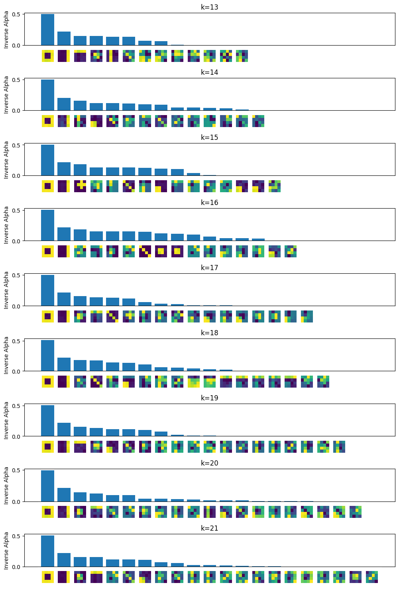
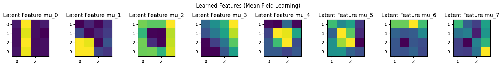
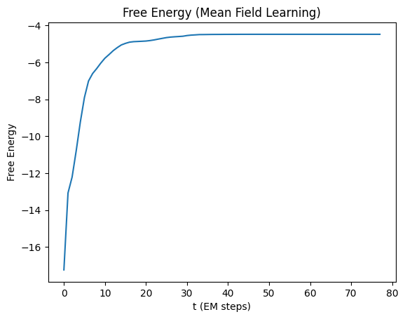
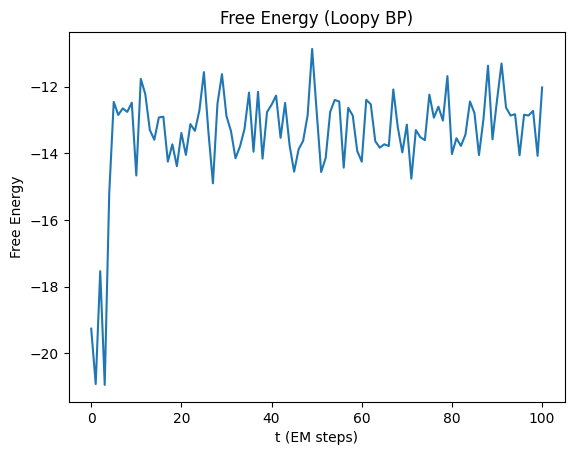
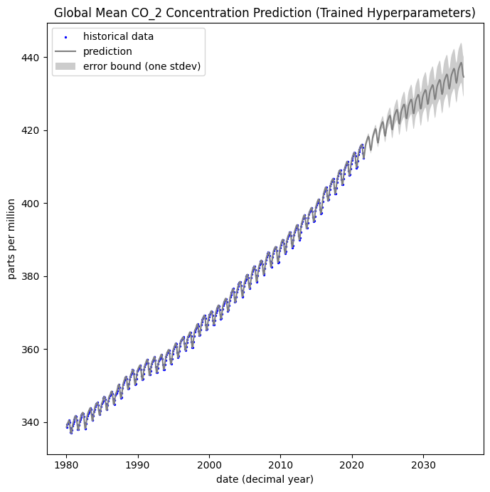

# Approximate Inference and Learning in Probabilistic Models

Assignment for Approximate Inference and Learning in Probabilistic Models (COMP0085) at UCL 2022

- Variational Bayes & Automatic Relevance Determination (ARD)
- Mean Field Learning
- Loopy Belief Propagation
- Gaussian Process Regression

To set up your python environment:

1. Install `poetry`

```shell
pip install poetry
```

2. Install dependencies

```shell
poetry install
```

## Variational Bayes Automatic Relevance Determination:
<p align="center">
  
</p>
<p align="center">
  <em>Automatic Relevance Determination (8 Actual Latent Factors)</em>
</p>

## Mean Field Learning:
<p align="center">
  
</p>
<p align="center">
  <em>Learned Latent Factors</em>
</p>

<p align="center">
  
</p>
<p align="center">
  <em>EM Free Energy</em>
</p>

## Loopy Belief Propagation:
<p align="center">
  
</p>
<p align="center">
  <em>Learned Latent Factors</em>
</p>

<p align="center">
  
</p>
<p align="center">
  <em>EM Free Energy (doesn't converge)</em>
</p>

## Gaussian Process Regression:
<p align="center">
  
</p>
<p align="center">
  <em>CO2 Extrapolation</em>
</p>
